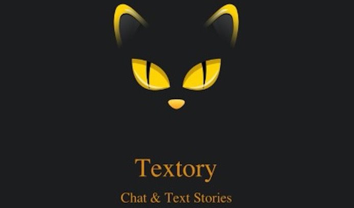
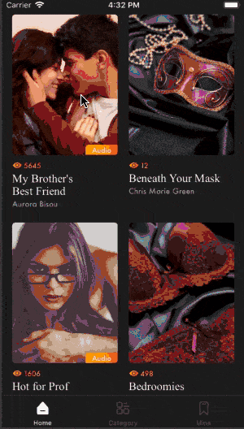

# SCChatStory

对话小说，类似微信聊天对话模式看小说，支持语音自动播放。


## 效果图



## 项目特点

* 多种对话样式
* 使用UIViewControllerAnimatedTransitioning实现转场动画
* 自动播放小说


## 代码说明

1.根据数据创建Tableviewcell聊天布局样式

 CSMessageFrame.h文件

```
//聊天内容计算model
@interface CSMessageFrame : NSObject
//名字CGRect
@property (nonatomic, assign, readonly) CGRect nameF;
//内容CGRect
@property (nonatomic, assign, readonly) CGRect contentF;
//整体cell高度
@property (nonatomic, assign, readonly) CGFloat cell_h;
//消息模型
@property (nonatomic, strong) CSMessageModel *message;
```

CSMessageFrame.m文件

```
- (void)setRomanceMessage:(CSMessageModel *)message
{
    CSCellType cellType = self.message.cellType;
    
    CGFloat content_y = 0;
    CGFloat name_x = 0;
    content_y = kname_Top_margin;
    //计算名字
    if (cellType == CSCellType_Left) {
        
        name_x  = kname_horizontal_margin;
        
    }else if (cellType == CSCellType_Right){
        
        name_x = CSY_WIDTH - kname_horizontal_margin;
    }
    _nameF = CGRectMake(name_x, content_y, CSY_WIDTH - 2 * name_x, kChat_name_h);
    // 计算整体聊天气泡的Size
    CGSize contentSize = CGSizeZero;
    //判断消息类型
    if (self.message.imageFile) {
        
        contentSize = CGSizeMake(200, 250);
        
    }else{
        
        UIFont *font = nil;
        if (cellType == CSCellType_Middle) {
            font = [UIFont fontWithName:@"Helvetica-Oblique" size:15];
        }else{
            font = [UIFont systemFontOfSize:15];
        }
        contentSize = [message.text sc_calculateSizeInFont:font withStableSize:CGSizeMake(260, CGFLOAT_MAX)];
        //其他微调
        if (font.lineHeight < kChat_Romance_min_h) {//为了使聊天内容与最小高度对齐
            contentSize.height += (kChat_Romance_min_h - font.lineHeight);
        }else{
            contentSize.height += 2*kChat_margin;
        }
        contentSize.width += 2*kChat_margin;
    }
    
    CGFloat content_x = 0;
    if (cellType == CSCellType_Middle) {
        
        content_x = (CSY_WIDTH - contentSize.width) / 2;
        
        //聊天气泡frame
        _contentF = CGRectMake(content_x, content_y, contentSize.width, contentSize.height);
        //cell高度
        _cell_h = CGRectGetMaxY(_contentF);
        
    }else{
        if (cellType == CSCellType_Left) {
            
            content_x = name_x;
        }else{
            content_x = name_x - contentSize.width;
        }
        content_y = CGRectGetMaxY(_nameF) + 7;
        //聊天气泡frame
        _contentF = CGRectMake(content_x, content_y, contentSize.width, contentSize.height);
        //cell高度
        _cell_h = CGRectGetMaxY(_contentF);
    }
}
```

项目里面还有其他样式，可自行调整。


2.转场动画

```
#pragma mark UINavigationControllerDelegate methods

- (id<UIViewControllerAnimatedTransitioning>)navigationController:(UINavigationController *)navigationController
                                  animationControllerForOperation:(UINavigationControllerOperation)operation
                                               fromViewController:(UIViewController *)fromVC
                                                 toViewController:(UIViewController *)toVC {
    // Check if we're transitioning from this view controller to a DSLSecondViewController
    if (fromVC == self && [toVC isKindOfClass:[CSStoryDetailViewController class]]) {
        return [[CSTransitionFromCategoryToDetail alloc] init];
    }
    else {
        return nil;
    }
}
```

```
- (void)animateTransition:(id<UIViewControllerContextTransitioning>)transitionContext {
    
    CSBaseViewController *toViewController = [transitionContext viewControllerForKey:UITransitionContextToViewControllerKey];

    UIView *containerView = [transitionContext containerView];
    NSTimeInterval duration = [self transitionDuration:transitionContext];
    
    toViewController.view.frame = [transitionContext finalFrameForViewController:toViewController];
    toViewController.view.alpha = 0;
    
    [containerView addSubview:toViewController.view];
    
    [UIView animateWithDuration:duration animations:^{
        
        toViewController.view.alpha = 1.0;
        
        
    } completion:^(BOOL finished) {
        
        [transitionContext completeTransition:!transitionContext.transitionWasCancelled];
    }];
    
}
#pragma mark - 过渡的持续时间
- (NSTimeInterval)transitionDuration:(id<UIViewControllerContextTransitioning>)transitionContext {
    return 0.5;
}
```

3.自动播放小说

```
- (IBAction)CSClickAudio:(id)sender {
    
    if (!self.isOpen) {
        
        [self.audio_btn setImage:[UIImage imageNamed:@"CS_reading_audio_on"] forState:UIControlStateNormal];
        self.isOpen = YES;
        CSAudioModel *model = [[CSAudioModel alloc] init];
        model.url = self.storyModel.story.audioSoundFileUrl;
        model.uid = self.storyModel.story.uid;
        NSString *str = self.audioTimeArray[self.index];
        model.currentTime = str.doubleValue;
        [[NSNotificationCenter defaultCenter] postNotificationName:@"playAudio" object:nil userInfo:@{@"audio":model}];
        
    }else{
        if (self.timer) {
            [self.timer invalidate];
            self.timer = nil;
        }
        [self.audio_btn setImage:[UIImage imageNamed:@"CS_reading_audio_off"] forState:UIControlStateNormal];
        self.isOpen = NO;
        [[NSNotificationCenter defaultCenter] postNotificationName:@"stopAudio" object:nil];
    }
    
}
```

通过发送通知控制音频开关。

## 联系

Email：15756377633@163.com
Wechat：v268743

## License

The SCJigsawPuzzle project is available for free use, as described by the LICENSE (Apache 2.0).
